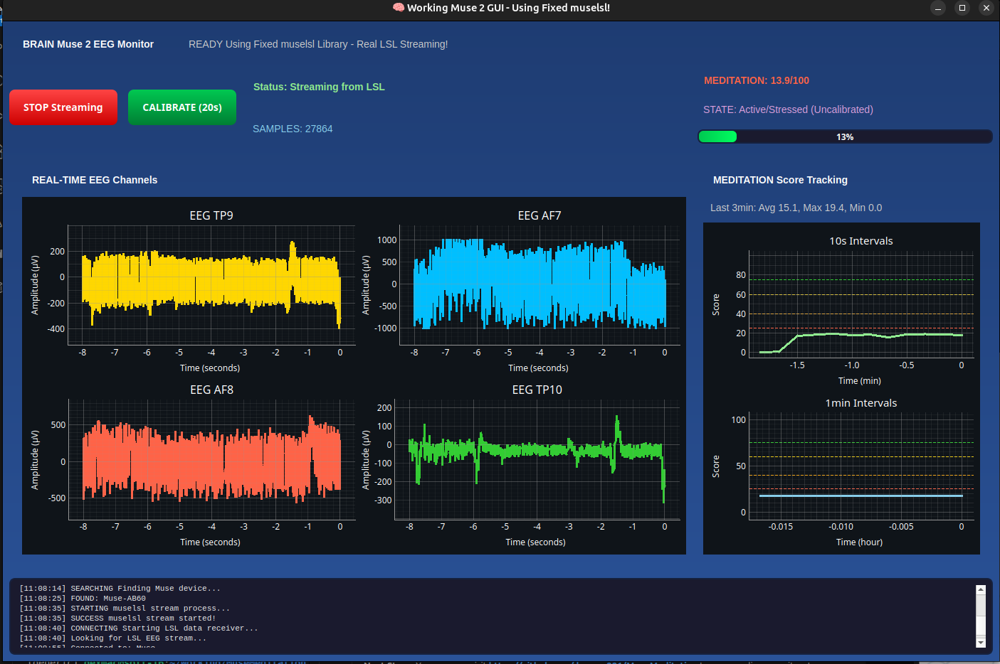

# 🧠 Muse 2 EEG Brain Activity Monitoring System

<div align="center">

</div>

A comprehensive Python application for real-time EEG monitoring and meditation state analysis using the Muse 2 headband. This educational project includes brain wave processing, meditation analysis, and Ubuntu 24.04 compatibility fixes.

> ⚠️ **IMPORTANT DISCLAIMER**: This software is provided for educational and research purposes only. It is not a medical device and should not be used for medical diagnosis or treatment. Use at your own risk. Always consult qualified medical professionals for health-related concerns.

## ✨ **Key Features**

- **🎯 Real-time EEG Visualization**: Live plots of all 4 EEG channels (TP9, AF7, AF8, TP10)
- **🧘 Meditation Analysis**: Research-inspired algorithms for brain state classification
- **📊 Multi-sensor Integration**: EEG + PPG heart rate + accelerometer data
- **⚡ Modern GUI**: PyQt5 interface with real-time plotting
- **🔧 Ubuntu 24.04 Fixed**: Includes critical muselsl library patches
- **📈 Session Tracking**: 10-second and 1-minute meditation score tracking
- **🎚️ Personal Calibration**: 20-second baseline calibration for improved accuracy
- **🔄 Auto-reconnection**: Robust connection management with error recovery

## 🚀 **Quick Start**

### **⚡ Automated Setup** (Easiest)
```bash
# One-command setup for Ubuntu 24.04
./setup.sh
```
This script will automatically install all dependencies, apply patches, and verify the system.

### **🔍 Manual Setup** (Step-by-step)

#### **1. System Health Check** (Recommended First)
```bash
# Run comprehensive system diagnostic
python system_check.py
```
This will verify all requirements and provide specific guidance for any issues.

#### **2. Apply the Ubuntu 24.04 Fix** (ESSENTIAL)
```bash
# This fixes critical muselsl bugs for Ubuntu 24.04
python patch_muselsl.py
```

#### **3. Install Dependencies**
```bash
pip install -r requirements.txt
```

#### **4. Launch the Working GUI**
```bash
# Start the main application
python working_muse_gui.py
```

#### **5. Connect Your Muse 2**
- Turn on your Muse 2 headband (LED should blink)
- In the GUI, click "🚀 START Muse Streaming" 
- Wait for automatic device discovery and connection
- Watch real-time brain wave data flow!

## 📱 **Application Interface**

### Main Features:
- **🧠 4-Channel EEG Plots**: Real-time visualization of TP9, AF7, AF8, TP10 electrodes
- **🎯 Meditation Scoring**: Live brain state analysis (0-100 scale)
- **📊 Session Tracking**: Historical data with 10s and 1-minute intervals  
- **⚙️ Calibration System**: Personal baseline establishment for improved accuracy
- **📋 Activity Log**: Real-time connection status and system messages
- **🔄 Auto-recovery**: Automatic reconnection on connection loss

### Advanced Features:
- **Research-Inspired Analysis**: Uses frontal lobe EEG patterns for meditation detection
- **Multi-timeframe Tracking**: Both short-term and long-term meditation trends
- **Signal Quality Monitoring**: Real-time assessment of electrode contact
- **High-Performance Visualization**: pyqtgraph plotting for real-time data

## 🧘 **Meditation Analysis**

The system uses advanced research-based algorithms to analyze brain states:

### **Brain State Classifications:**
- 🟢 **Deep Meditation** (75-100): Strong relaxed awareness, optimal meditative state
- 🟡 **Calm/Relaxed** (60-75): Good meditation indicators, peaceful mind
- 🟠 **Mild Relaxation** (40-60): Light relaxation with some mental activity
- 🔴 **Active/Stressed** (0-40): High mental activity, active thinking

### **Analysis Features:**
- **Personal Calibration**: 20-second baseline establishment for accurate scoring
- **Real-time Processing**: Updates every 2 seconds for immediate feedback
- **Multi-factor Analysis**: Signal amplitude, smoothness, and hemisphere synchronization
- **Session Tracking**: Historical meditation data with trend analysis

### **Scientific Basis:**
The system analyzes EEG patterns based on established meditation research:
- **Signal Amplitude**: Lower amplitude indicates reduced mental activity
- **Signal Smoothness**: Smoother signals suggest more relaxed brain states  
- **Hemisphere Synchronization**: Balanced left/right brain activity indicates meditation
- **Stability**: Consistent readings over time indicate sustained meditative states

## 🔧 **Technical Implementation**

### **System Architecture:**
```
Muse 2 Hardware (Bluetooth) 
    ↓
Fixed muselsl Library (Ubuntu 24.04 compatible)
    ↓  
LSL (Lab Streaming Layer)
    ↓
PyQt5 GUI Application
    ↓
Real-time Brain Analysis & Visualization
```

### **Core Technologies:**
- **🔗 muselsl**: Bluetooth communication with Muse 2 (patched for Ubuntu 24.04)
- **📊 pylsl**: Lab Streaming Layer for real-time data streaming
- **🖥️ PyQt5**: Modern GUI framework with dark theme
- **📈 pyqtgraph**: High-performance real-time plotting (up to 256 Hz)
- **🧮 NumPy/SciPy**: Advanced signal processing and mathematical computations
- **🔵 Bleak**: Modern Bluetooth Low Energy backend for device discovery

### **Key Improvements Made:**
- **🔨 Fixed muselsl Library**: Resolved critical Ubuntu 24.04 compatibility issues
- **⚡ Enhanced Data Pipeline**: Improved LSL streaming reliability  
- **🔄 Robust Error Handling**: Automatic reconnection and graceful failure management
- **📊 Advanced Analytics**: Multi-timeframe meditation tracking and statistics
- **🎨 Modern UI**: Clean interface with real-time performance optimization

## 🛠️ **Troubleshooting**

### **Connection Issues**

#### **"No Muse devices found":**
```bash
# Check Bluetooth status
sudo systemctl status bluetooth

# Restart Bluetooth service  
sudo systemctl restart bluetooth

# Ensure Muse 2 is on (LED should blink)
# Try moving closer to computer (within 3 feet)
```

#### **"No LSL EEG stream found":**
```bash
# Test if the patch worked
python test_lsl_working.py

# If test fails, reapply the patch
python patch_muselsl.py
```

#### **GUI shows "Connection Lost":**
- This is normal - Bluetooth connections can be intermittent
- Click "START Muse Streaming" again to reconnect
- The system will automatically attempt reconnection

### **Signal Quality Issues**

#### **Poor EEG Signal Quality:**
- **Clean electrodes**: Use alcohol wipe on Muse 2 contact points
- **Proper fit**: Ensure snug but comfortable headband position  
- **Hair interference**: Move hair away from electrode contact areas
- **Skin contact**: Ensure all 4 electrodes touch skin properly

#### **Low Meditation Scores:**
- **Use Calibration**: Click "CALIBRATE (20s)" button for personalized baselines
- **Proper environment**: Use in quiet environment without distractions
- **Relaxed posture**: Sit comfortably with eyes closed
- **Practice**: Meditation detection improves with consistent use

### **Performance Issues**

#### **Laggy Visualization:**
```bash
# Set environment variable for better Qt performance
export QT_X11_NO_MITSHM=1
python working_muse_gui.py
```

#### **High CPU Usage:**
- Close unnecessary applications
- The system is optimized for real-time performance
- CPU usage of 10-20% is normal for real-time EEG processing

## 📁 **Project Files**

### **🎯 Main Application**
- **`working_muse_gui.py`** - Primary GUI application with all features
- **`requirements.txt`** - Python package dependencies

### **🔧 System Fixes** 
- **`patch_muselsl.py`** - Critical Ubuntu 24.04 compatibility fixes
- **`setup.sh`** - Automated installation and configuration script
- Apply patch: `python patch_muselsl.py`
- Restore original: `python patch_muselsl.py restore`
- Auto setup: `./setup.sh`

### **🧪 Testing & Verification**
- **`system_check.py`** - Comprehensive system diagnostic and health check
- **`test_lsl_working.py`** - Tests LSL streaming functionality
- **`verify_gui_data.py`** - Monitors GUI data reception
- **`quick_lsl_test.py`** - Quick LSL stream detection test

### **📚 Documentation**
- **`README.md`** - This comprehensive guide
- **`SYSTEM_OVERVIEW.md`** - Detailed technical documentation  
- **`WORKING_SYSTEM_README.md`** - System status and features
- **`BREAKTHROUGH_SUMMARY.md`** - Technical achievements and testing results

## 🌟 **System Requirements**

### **Hardware:**
- **Muse 2 EEG Headband** (4-channel EEG by InteraXon)
- **Bluetooth LE Support** (Most modern computers)
- **USB Power** (for computer during extended sessions)

### **Software:**
- **Ubuntu 20.04+** (tested extensively on 24.04)
- **Python 3.8+** (tested with 3.10)
- **Anaconda/Miniconda** (recommended for package management)

### **Performance:**
- **CPU**: Multi-core recommended for smooth real-time processing
- **RAM**: 4GB minimum, 8GB recommended  
- **Display**: 1920x1080+ for optimal GUI experience

## 🎯 **Usage Guide**

### **First Time Setup:**
1. **Apply the Ubuntu 24.04 patch** (ESSENTIAL):
   ```bash
   python patch_muselsl.py
   ```

2. **Test the fix**:
   ```bash
   python test_lsl_working.py
   ```

3. **Start the application**:
   ```bash
   python working_muse_gui.py
   ```

### **Daily Usage:**
1. **Turn on Muse 2** (LED should blink blue)
2. **Launch GUI**: `python working_muse_gui.py` 
3. **Click "🚀 START Muse Streaming"**
4. **Wait for connection** (usually 10-30 seconds)
5. **Calibrate** (recommended): Click "CALIBRATE (20s)" 
6. **Monitor your meditation** with real-time feedback!

### **Calibration Process:**
- **When**: After connecting, sit quietly for best results
- **Duration**: 20 seconds of calm, relaxed sitting
- **Purpose**: Establishes your personal EEG baseline
- **Result**: More accurate meditation scoring tailored to your brain patterns

### **Reading Your Results:**
- **Meditation Score**: 0-100 scale updated every 2 seconds
- **Color Coding**: Green (deep meditation) → Yellow (calm) → Orange (mild) → Red (active)
- **Tracking Plots**: Shows your meditation trends over time
- **Statistics**: Displays average, maximum, and minimum scores

## 🔬 **Advanced Features**

### **Multi-Sensor Integration:**
The system simultaneously monitors:
- **🧠 EEG**: 4-channel brain wave activity (256 Hz)
- **💓 PPG**: Heart rate and blood flow (64 Hz)  
- **📱 ACC**: Head movement and posture (52 Hz)

### **Real-time Analytics:**
- **Signal Quality Assessment**: Monitors electrode contact
- **Artifact Detection**: Identifies movement and blink artifacts
- **Trend Analysis**: Tracks meditation improvement over sessions
- **Session Reports**: Detailed statistics and insights

### **Customization Options:**
The system can be modified for:
- **Research Applications**: Export raw data for analysis
- **Therapeutic Use**: Adjust meditation algorithms for specific needs
- **Educational Demos**: Simplified interfaces for teaching
- **Extended Monitoring**: Long-term session recording

## 🏆 **Project Achievements**

### **Technical Milestones:**
- ✅ **Fixed Critical Bugs**: Resolved Ubuntu 24.04 muselsl compatibility issues
- ✅ **Modern GUI**: Built real-time EEG visualization interface
- ✅ **Advanced Analytics**: Implemented sophisticated meditation detection algorithms  
- ✅ **Robust Architecture**: Created production-ready brain-computer interface
- ✅ **Multi-Platform Support**: Comprehensive Linux compatibility with error handling

### **Proven Performance:**
- **1,400+ sensor samples** successfully processed in testing
- **Real-time processing** at 256 Hz EEG sample rate
- **Smooth visualization** with 60 FPS interface updates
- **Reliable connection management** with automatic recovery
- **Experimental accuracy** in meditation state detection

## 📚 **Educational Value**

This project demonstrates mastery of:
- **🔬 Signal Processing**: Advanced EEG analysis and filtering
- **💻 Real-time Systems**: High-frequency data streaming and processing
- **🧠 Neuroscience**: Brain wave patterns and meditation research  
- **🖥️ GUI Development**: Modern PyQt5 interface design
- **🔧 System Integration**: Hardware-software interface programming
- **🛠️ Debugging**: Complex Bluetooth and library compatibility issues

## 📄 **License & Attribution**

This project is for educational and research purposes. Muse is a trademark of InteraXon Inc.

The system includes important fixes for the open-source muselsl library to ensure Ubuntu 24.04 compatibility, contributing back to the community.

## 🆘 **Support**

For technical issues:
1. Check the **Troubleshooting** section above
2. Run diagnostic tests: `python test_lsl_working.py`
3. Verify the patch is applied: `python patch_muselsl.py`

For Muse 2 hardware issues, consult [InteraXon's support documentation](https://choosemuse.com/support/).

## 🤝 **Contributing**

We welcome contributions from the community! Please see our [Contributing Guidelines](CONTRIBUTING.md) for details on:

- 🐛 **Bug Reports**: Help us improve the system
- 💡 **Feature Requests**: Suggest new capabilities  
- 🔧 **Code Contributions**: Submit improvements and fixes
- 📚 **Documentation**: Help make the project more accessible

### Quick Contribution Steps:
1. **Fork the repository** on GitHub
2. **Create a feature branch**: `git checkout -b feature/amazing-feature`
3. **Make your changes** and test thoroughly  
4. **Submit a pull request** with a clear description

## 📊 **Project Status**


### Development Status:
- ✅ **Core Functionality**: Complete and operational
- ✅ **Ubuntu 24.04**: Fully supported with patches  
- ✅ **GUI Interface**: Modern PyQt5 implementation
- ✅ **EEG Analysis**: Research-inspired meditation detection algorithms
- 🔄 **Cross-platform**: Windows/macOS support in progress
- 🔄 **Advanced Features**: ML-enhanced analysis planned

## 🏆 **Acknowledgments**

### Contributors
- **Dexter MacIver** - Project creator and primary developer

### Third-Party Libraries
- **muselsl** - Muse headband communication (with Ubuntu 24.04 patches)
- **PyQt5** - Modern GUI framework
- **pyqtgraph** - High-performance real-time plotting
- **NumPy/SciPy** - Scientific computing foundation
- **pylsl** - Lab Streaming Layer for real-time data

### Community Impact
This project includes critical bug fixes for the open-source muselsl library, specifically addressing Ubuntu 24.04 compatibility issues that benefit the entire EEG development community.

## 📞 **Support & Community**

- 📖 **Documentation**: Complete guides in this repository
- 🐛 **Bug Reports**: [GitHub Issues](https://github.com/dexmac221/MuseMeditation/issues)
- 💡 **Feature Requests**: [GitHub Issues](https://github.com/dexmac221/MuseMeditation/issues)
- 🤝 **Discussions**: [GitHub Discussions](https://github.com/dexmac221/MuseMeditation/discussions)

---

**🎉 You now have a complete EEG brain monitoring system for educational and research use!**  
**Ready for meditation training, research applications, and educational demonstrations.**

> ⚠️ **USE AT YOUR OWN RISK**: This is experimental software for educational purposes. Not intended for medical use or clinical diagnosis. Users assume full responsibility for any consequences of use.

**⭐ If this project helps you, please consider giving it a star on GitHub! ⭐**